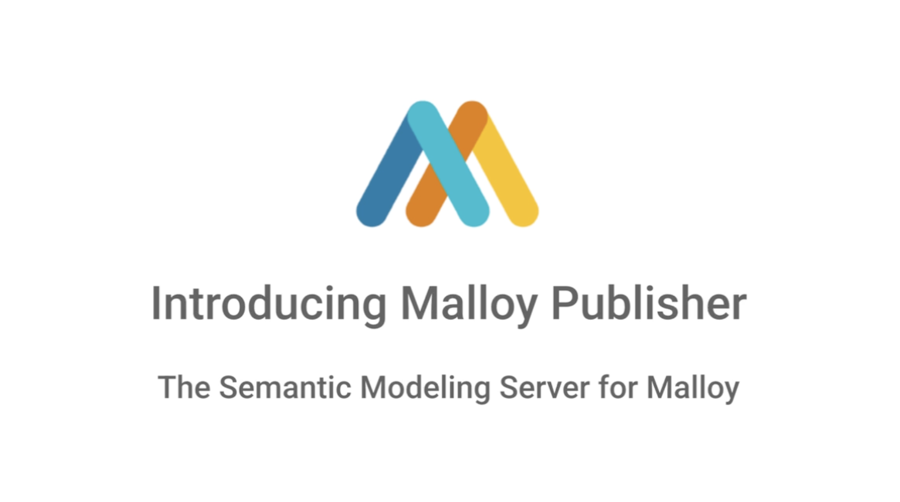
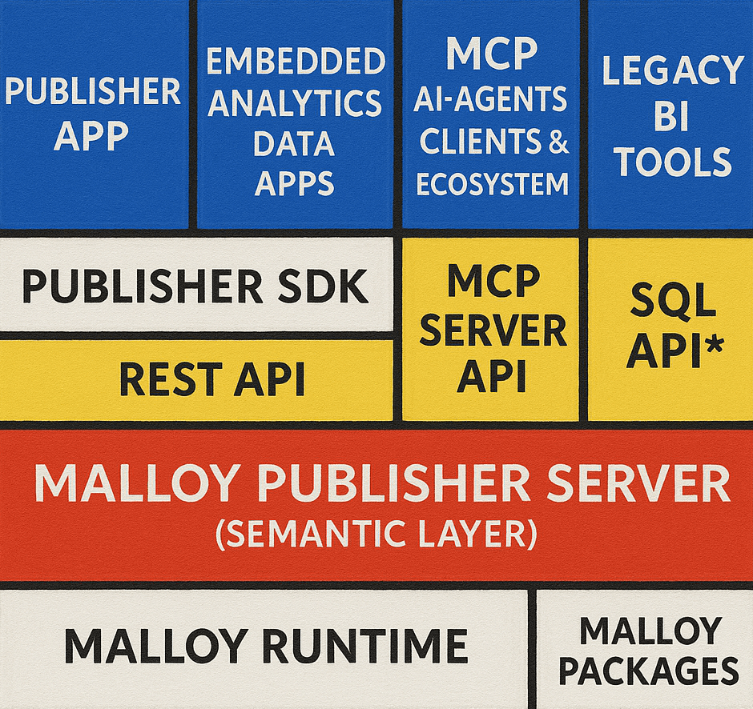

# Publisher: The Malloy Semantic Model Server

<a href="https://github.com/malloydata/publisher/actions/workflows/build.yml" target="_blank" rel="noopener noreferrer"></a>

**Publisher** is the open-source semantic model server for the <a href="https://github.com/malloydata/malloy" target="_blank" rel="noopener noreferrer">Malloy</a> data language. It lets you define semantic models once — and use them everywhere.

## What is Malloy?

<a href="https://malloydata.dev" target="_blank" rel="noopener noreferrer">Malloy</a> is an open-source language for modeling data. It allows you to define rich **semantic data models** — specifying the _meaning_, _relationships_, and _context_ behind your data.

Malloy models encode trusted business logic (e.g., revenue, active users, churn), and let you query data in terms of your business — not raw SQL. These models are version-controlled, composable, and portable across environments.

You can develop Malloy models using the <a href="https://marketplace.visualstudio.com/items?itemName=malloydata.malloy-vscode" target="_blank" rel="noopener noreferrer">VS Code extension</a>, which provides an ergonomic environment for writing models, running queries, and building dashboards.

## What is Publisher?

**Publisher** serves Malloy models through clean APIs — enabling consistent, interpretable, and AI-ready data access for tools, applications, and agents.

Publisher is designed around a familiar, proven workflow:

- A **data modeler** defines trusted business logic in Malloy using the VS Code extension and serves their models using the Publisher server.
- A **data consumer** explores and extends that logic using Malloy's no-code **Explorer**, notebooks, custom data appications, or AI agents.

This mirrors the modeler → analyst flow popularized by tools like DBT and Looker — now reimagined for the AI era, and built on fully open infrastructure.

## Why It Matters

You can't trust answers if the meaning behind the data isn't clear.

Whether you're building dashboards, deploying AI agents, or enabling ad hoc analysis, every experience relies on a shared understanding of terms like "MRR," "LTV," or "active user." Without that foundation, insights are inconsistent — or dangerously wrong.

Publisher solves this by turning semantic models into reusable data APIs. By combining Malloy's expressive modeling language with an open-source server and no-code data analysis UI, Publisher makes the semantic layer accessible, governable, and extensible — for everyone.

# From Semantic Models to Data Experiences

Every Publisher experience starts with a semantic model — written in <a href="https://malloydata.dev" target="_blank" rel="noopener noreferrer">Malloy</a> and served via the Publisher server. You can create your own model using the <a href="https://github.com/malloydata/malloy-vscode-extension" target="_blank" rel="noopener noreferrer">Malloy VS Code extension</a>, or use one of the sample models from the <a href="https://github.com/malloydata/malloy-samples" target="_blank" rel="noopener noreferrer">`malloy-samples`</a> repository, which is included in this repo as a submodule.

## Serving Models

To bring your semantic models to life, you can run the Publisher server locally and browse your models using the Publisher App in your browser. The app provides a powerful, no-code interface for exploring and querying your models.

For instructions on how to set up, build, and configure the Publisher server, see:

- [Build & Run Instructions](#build-and-run-instructions)
- [Server Configuration](#server-configuration)

The Publisher's default server configuraiton serves the <a href="https://github.com/malloydata/malloy-samples" target="_blank" rel="noopener noreferrer">`malloy-samples`</a>. Once the server is running, you can access the app at:

- **Publisher App (REST API + UI):** <a href="http://localhost:4000" target="_blank" rel="noopener noreferrer">http://localhost:4000</a>

<center>
  <a href="https://www.loom.com/share/f4e7adbe72f040a889a36bc820578447?sid=839ea1eb-b0dd-46a7-aaf5-585cc8ec066b" target="_blank" rel="noopener noreferrer">
      
  </a>
  <br>
  <em>📹 Click the image above to watch the demo video</em>
  <br>
  <br>
</center>

# Architecture Overview

Publisher consists of three main components: the Publisher Server (APIs & backend, now including MCP support), the Publisher SDK (UI components), and the Publisher App (a reference data app implementation).

The image below illustrates the composition of the Publisher's components and the tools & applications it can support.

<center>

</center>
<br>

**1. Publisher Server (`packages/server/`)**

- **Core Backend:** This is the heart of Publisher. It's a server application responsible for loading and managing Malloy Packages, which encapsulate your semantic models.
- **Malloy Integration:** It utilizes the Malloy runtime to parse `.malloy` files, understand the rich semantic models defined within them (including relationships, calculations, and business context), and compile Malloy queries into SQL for execution against target databases (BigQuery, Snowflake, Trino, DuckDB, Postgres, MySQL).
- **API Layers:** The Publisher server exposes two primary API interfaces:

  - **REST API:**
    - **Purpose:** Used by the web frontend (Publisher App/SDK) for browsing packages, models, and executing queries.
    - **Specification:** Defined in [`api-doc.yaml`](api-doc.yaml).
  - **Model Context Protocol (MCP) API:**
    - **Purpose:** Allows AI agents and other MCP clients to interact with Malloy resources (projects, packages, models, sources, views, notebooks) and execute queries programmatically.
    - **Demo Video:** <a href="https://www.loom.com/share/fcc5112ac1ca4bf78bee0985f1cd31be" target="_blank" rel="noopener noreferrer">MCP + AI Agent walkthrough →</a>  
    - **Docs:** <a href="docs/ai-agents.md" target="_blank" rel="noopener noreferrer">AI Agents & MCP Guide →</a>
    - **Specification:** Adheres to the <a href="https://modelcontextprotocol.io/specification/2025-03-26/" target="_blank" rel="noopener noreferrer">MCP `2025-03-26` specification revision</a>. This includes providing resource metadata and detailed error messages with suggestions.
  - **SQL API (coming soon):**
    - **Purpose:** Connect to you existing tools.

- **Malloy Package Format:** The Publisher Server loads semantic models, notebooks, and transformations based on the Malloy Package format. This format is designed to integrate seamlessly with standard developer practices.
  - **Goal: Scalability and Governance through Standard Practices:** Enable engineers to manage, version, test, and distribute their data transformations and semantic models using familiar workflows (local development, CI/CD) and distribution mechanisms (e.g., packages, container images, registries). This aims to scale data development far beyond the limitations of current ad-hoc approaches. Crucially, leveraging these standard software engineering practices provides a natural form of **governance**. When a versioned package is pushed by a trusted source to a central repository or registry, that specific version effectively becomes the blessed or "governed" definition for consumption. This contrasts sharply with the complex, often bespoke processes required by traditional data catalogs or BI tools to achieve similar levels of trust and governance for data assets.
  - **Structure:** A Malloy package is currently defined as a directory containing:
    - One or more `.malloy` files defining data models, queries, and transformations.
    - Optionally, one or more `.malloynb` files (Malloy Notebooks) for ad hoc analysis, exploration, and dashboard-like presentation.
    - A `publisher.json` manifest file.
  - **Manifest (`publisher.json`):** Contains metadata about the package. Currently, it supports `name`, `version`, and `description` fields. This schema will be expanded significantly as Publisher evolves to better support dependency management, versioning, and integration with package/container registries, further strengthening the governance model.

**2. Publisher SDK (`packages/sdk/`)**

- **UI Component Library:** A collection of reusable React components designed for building user interfaces that interact with a Publisher Server's _RESTful API_.
- **Embeddable:** Intended to be imported and used within other React-based data applications, allowing developers to easily add Malloy model browsing and querying capabilities for human users.
- **Server Communication:** Handles fetching data and sending query requests to the Publisher Server's REST APIs.

**3. Publisher App (`packages/app/`)**

- **Reference Implementation:** A standalone web application built using the Publisher SDK.
- **Functionality:** Allows users to connect to a running Publisher Server instance (via the REST API), browse Malloy packages, view model contents, and run queries. Analysts can also generate embeddable code snippets or dive into ad hoc exploration.
- **Explorer:** A no-code query builder that allows analysts to explore and extend Malloy models without writing SQL. Explorer enables non-technical users to ask meaningful, model-driven questions — completing the loop from governed model → self-serve data analysis. [Explorer Documentation →](READMEs/explorer.md)
- **Purpose:** Publisher App is more than a demo — it's a **professional-grade, open-source data exploration tool**. At the same time, it serves as a **reference design** for building your own data applications on top of Malloy and Publisher. With Publisher and its SDK, developers can rapidly build trusted, composable, AI-ready data experiences.

# Build and Run Instructions

### No Code

If you just want to run the Publisher without modify the code, you can do so directly from `bunx` or `npx`:

```sh
npx @malloy-publisher/server --port 4000 --server_root /path/to/malloy_packages
```

To run the server pointed to the Malloy samples:

```sh
git clone https://github.com/credibledata/malloy-samples
npx @malloy-publisher/server --port 4000 --server_root .
```

### Docker

Alternatively, you can start a container locally or self-host it with [Docker](https://www.docker.com/).

Once Docker is installed, in a new folder with your data, create a file called `publisher.config.json` with these contents:
```json
{
    "frozenConfig": false,
    "projects": [
      {
        "name": "malloy-samples",
        "packages": [
            {
            "name": "ecommerce",
            "location": "https://github.com/credibledata/malloy-samples"
          },
          {
            "name": "imdb",
            "location": "https://github.com/credibledata/malloy-samples"
          },
          {
            "name": "faa",
            "location": "https://github.com/credibledata/malloy-samples"
          },
          {
            "name": "bigquery-hackernews",
            "location": "https://github.com/credibledata/malloy-samples"
          }
        ]
      }
    ]
  }

```

That file will tell the publisher where to look for the Malloy Samples, and you can now run the following command that will link the newly created file with a Docker container:
```sh
docker run -p 4000:4000 \
   -v ./publisher.config.json:/publisher/publisher.config.json
  ms2data/malloy-publisher
```
Then, open http://localhost:4000 in your browser to continue setup.

You can add more projects of your own by attaching additional volumes and referencing them in the config file.

### Code Approach

Follow these steps to build the Publisher components and run the server locally. This project uses <a href="https://bun.sh/" target="_blank" rel="noopener noreferrer">`bun`</a> as the JavaScript runtime and package manager.

**1. Initialize and Update Git Submodules:**

The Publisher repository uses Git submodules to include sample Malloy models (currently a fork of `malloy-samples`). These samples are used for testing and demonstrating Publisher's capabilities.

First, initialize the registered submodules:

```bash
git submodule init
```

Then, update the submodules to fetch their content:

```bash
git submodule update
```

**2. Install Dependencies:**

Install all necessary project dependencies (including those for the server, SDK, and app) using bun:

```bash
bun install
```

**3. Build the Project:**

Compile the TypeScript code for all packages (server, SDK, app) into JavaScript:

```bash
bun run build:server-deploy
```

**4. Start the Publisher Server:**

Run the compiled server code. By default, this will start the REST API server on port 4000 and the MCP server on port 4040. The server will load the Malloy packages found in the submodules.

```bash
bun run start
```

Once started, you can typically access the Publisher App (if running) at <a href="http://localhost:4000" target="_blank" rel="noopener noreferrer">http://localhost:4000</a> and the MCP endpoint at <a href="http://localhost:4040/mcp" target="_blank" rel="noopener noreferrer">http://localhost:4040/mcp</a>.

See [packages/app/README.md](packages/app/README.md) for information on how to do development on the server.

**5. (Optional) Configure GCP Credentials for BigQuery Samples:**

Some of the included malloy-samples run queries against Google BigQuery public datasets. To run these specific samples, you need to authenticate with Google Cloud:

Update your Application Default Credentials (ADC) by logging in with gcloud:

```bash
gcloud auth login --update-adc
```

Set your default GCP project (replace {my_project_id} with your actual project ID, though for public datasets, any valid project should generally work):

```bash
gcloud config set project {my_project_id} --installation
```

The Publisher server (specifically the Malloy runtime) will automatically use these credentials when connecting to BigQuery.

# Server Configuration

Publisher uses configuration files on the local filesystem to manage server settings and project-specific details like database connections.

- **Server Configuration (`publisher.config.json`):**

  - **Location:** Stored at the `SERVER_ROOT` directory (the directory from which the `publisher-server` command is run or where the server package is located).
  - **Purpose:** Defines the overall server environment, primarily by listing the available "projects" and their relative paths. A project represents a distinct environment or collection of packages. It also contains the database connection configurations (credentials, database names, types like BigQuery/Postgres/DuckDB, etc.) required by the Malloy models within that project's packages.
  - **Example:** See [`packages/server/publisher.config.json`](packages/server/publisher.config.json) for the basic structure.

- **Environment Management:**

  - This two-tiered configuration structure (server-level listing projects, project-level defining connections) allows for standard environment separation (e.g., `dev`, `staging`, `prod`), a common practice in cloud development.
  - You can create separate project directories for each environment.
  - Crucially, these environment-specific project directories can reference the _same_ underlying Malloy packages (containing the models and notebooks) using symbolic links.

  - **Example File Structure:**
    ```
    SERVER_ROOT/
    ├── publisher.config.json       # Lists 'staging' and 'prod' projects with their connections
    │
    ├── packages/                   # Contains the actual Malloy packages
    │   ├── package1/
    │   │   └── model.malloy
    │   ├── package2/
    │   └── ...
    │
    ├── staging/                    # Staging environment project
    │   ├── package1 -> ../packages/package1  # Symbolic link
    │   └── package2 -> ../packages/package2  # Symbolic link
    │
    └── prod/                       # Production environment project
        ├── package1 -> ../packages/package1   # Symbolic link
        └── package2 -> ../packages/package2   # Symbolic link
    ```
  - **Benefit:** This allows you to build a single Docker image containing the Publisher server and all Malloy packages. You can then deploy this _same image_ to different environments (staging, production). By configuring your staging and productio jobs to point to the appropriate project (`staging` or `prod`), you ensure the correct connection credentials are used for each environment without rebuilding the image or modifying the core package code.

## Upgrading Malloy dependencies

To update to a new NPM release of `@malloydata/*`:

```
bun run upgrade-malloy 0.0.XXX #XXX is the new version number
bun install # This updates node_modules
```

> **_NOTE:_** Note that the Publisher repository currently points to a <a href="https://github.com/pathwaysdata/malloy-samples" target="_blank" rel="noopener noreferrer">fork</a> of the <a href="https://github.com/malloydata/malloy-samples" target="_blank" rel="noopener noreferrer">malloy-samples</a> repo. The fork contains minor changes to turn each Malloy sample directory into a package. Once the package format solidifies, we intend to merge the changes into the main malloy-samples repo.

# Coming Soon

We are actively developing Publisher and plan to introduce several exciting features:

- **Scheduled Transform Pipelines:** Extend Publisher to orchestrate the execution of Malloy transformations on a schedule. Define pipelines within your Malloy packages to update materialized views, create summary tables, or perform other routine data preparation tasks directly managed by Publisher.
- **DBT Integration:** Bridge the gap with the popular dbt ecosystem. Potential integration points include referencing Malloy models within dbt and triggering Malloy transformations as part of dbt workflows.
- **Airflow Integration:** Enable seamless integration with Apache Airflow. This could involve custom Airflow operators to trigger Publisher actions like model refreshes or scheduled pipeline runs, allowing Malloy/Publisher tasks to be incorporated into larger, complex data orchestration DAGs.
- **SQL API:** Connect your existing BI & data tools to Malloy semantic models via a Postgres SQL API.

## Join the Malloy Community

- Join our <a href="https://join.slack.com/t/malloy-community/shared_invite/zt-1kgfwgi5g-CrsdaRqs81QY67QW0~t_uw" target="_blank" rel="noopener noreferrer">**Malloy Slack Community!**</a> Use this community to ask questions, meet other Malloy users, and share ideas with one another.
- Use <a href="https://github.com/malloydata/publisher/issues" target="_blank" rel="noopener noreferrer">**GitHub issues**</a> in this Repo to provide feedback, suggest improvements, report bugs, and start new discussions.
