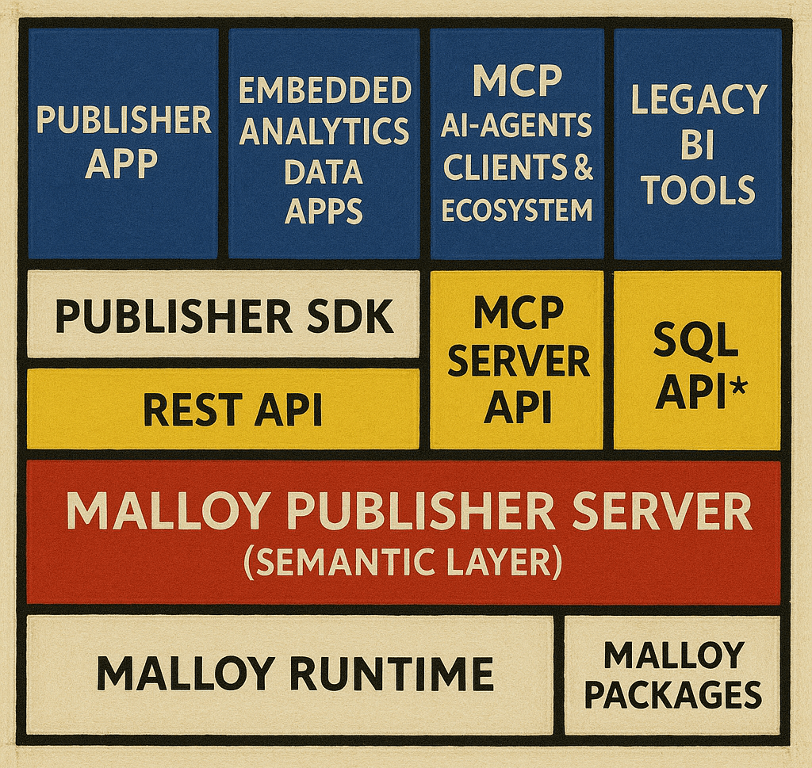
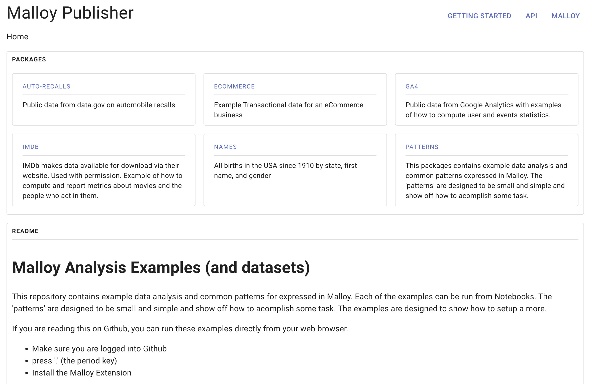
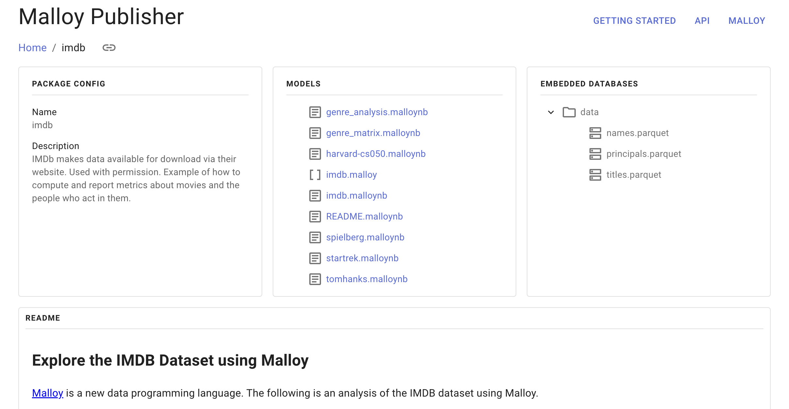
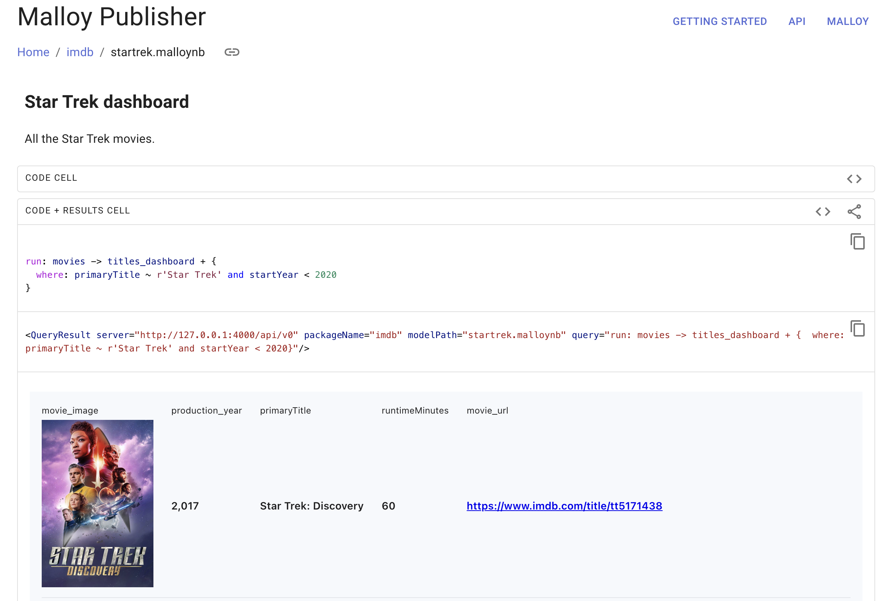

# Malloy Publisher

[](https://github.com/malloydata/publisher/actions/workflows/build.yml)

The Malloy Publisher is a basic semantic model server and web application for exploring Malloy packages.  The goals of the Publisher project are:
1. Create a local development environment for Malloy data app development.
1. Develop & standardize Malloy's package format and serving APIs.
1. Activate the Malloy open source community!

The diagram below illustrates the Publisher's basic components: Publisher App, Publisher SDK, and Publisher Server. 



The [Publisher app](packages/app/) allows you to browse packages, their contents, and generate code snippets that can be embedded into a data application. See the screenshots below.

The Publisher app is composed of a set React components. The React components form an [SDK](packages/sdk) that can be embedded in other data applications.  The SDK's React components call the Publisher server's [APIs](api-doc.yaml) to fetch package metadata and query results.

The [Publisher server](packages/sdk) is a simple semantic layer.  While its primary purpose currently is to facilitate local data app development, it can easily be bundled with a set of Malloy packages in a docker image in order to serve Malloy models and packages (coming soon).  We also imagine running the Publisher in-browser in the future to enable folks to easily share and analyze Malloy packages just about anywhere.

Currently, a Malloy package consists of a set of files in a directory with a publisher.json file.  The publisher.json only supports two fields at the moment (name & description).  We intend to add more fields as we build out Publisher functionality.

## Screenshots

<center>
    <figcaption>Browse loaded packages</figcaption>
    
</center>
<br>
<center>
    <figcaption>Explore a package's contents</figcaption>
    
</center>
<br>
<center>
    <figcaption>Explore Malloy models and notebooks</figcaption>
    
</center>

## Build and Run Instructions

To build and run the package server, first load the malloy-samples.
```
git submodule init
git submodule update
```

Then build and run the package server:
```
npm install
npm run build
npm run start
```
> **_NOTE:_**  Note that the Publisher repository currently points to a [fork](https://github.com/pathwaysdata/malloy-samples) of the [malloy-samples](https://github.com/malloydata/malloy-samples) repo.  The fork contains minor changes to turn each Malloy sample directory into a package.  Once the package format solidifies, we intend to merge the changes into the main malloy-samples repo.

## Coming Soon

* Developer mode that automatically recompiles models and refreshes the publisher app as you make changes
* Embed Composer's [Explore UI](https://github.com/malloydata/malloy-composer) to enable ad hoc anslysis of packages via a UI
* Scheduled transform pipelines
* Scheduled report generation
* Dockerfile
* In-browser

---

## Join the Malloy Community

- Join our [**Malloy Slack Community!**](https://join.slack.com/t/malloy-community/shared_invite/zt-1kgfwgi5g-CrsdaRqs81QY67QW0~t_uw) Use this community to ask questions, meet other Malloy users, and share ideas with one another.
- Use [**GitHub issues**](https://github.com/malloydata/publisher/issues) in this Repo to provide feedback, suggest improvements, report bugs, and start new discussions.

## Resources

Documentation:

- [Malloy Language](https://malloydata.github.io/malloy/documentation/language/basic.html) - A quick introduction to the language
- [eCommerce Example Analysis](https://malloydata.github.io/malloy/documentation/examples/ecommerce.html) - a walkthrough of the basics on an ecommerce dataset (BigQuery public dataset)
- [Modeling Walkthrough](https://malloydata.github.io/malloy/documentation/examples/iowa/iowa.html) - introduction to modeling via the Iowa liquor sales public data set (BigQuery public dataset)
- [YouTube](https://www.youtube.com/channel/UCfN2td1dzf-fKmVtaDjacsg) - Watch demos / walkthroughs of Malloy
